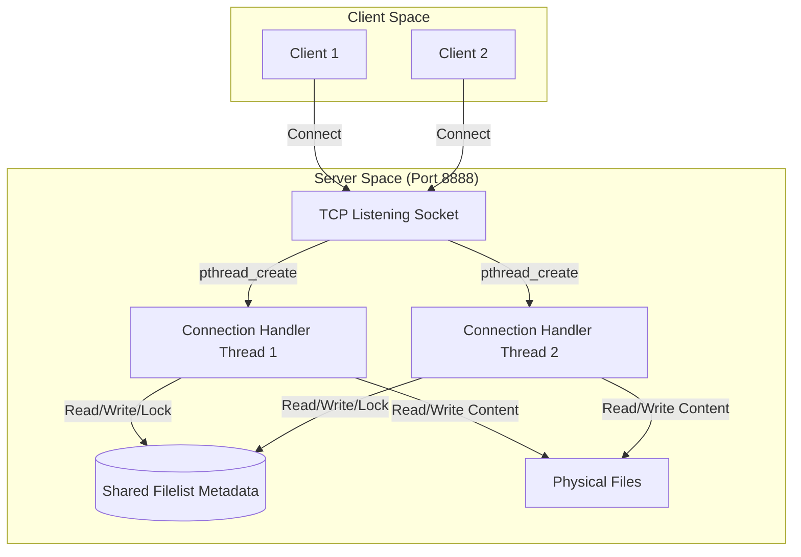

# 📂 多執行緒檔案共享系統 (Multi-threaded File Share Server)

本專案是一個使用 C 語言編寫的 **多執行緒檔案共享伺服器與客戶端系統**。它基於 Linux Socket API 進行網路通訊，並實現了精簡版的自主存取控制檔案權限管理以及簡單的讀寫鎖 (Read-Write Lock) 併發控制。

---

## ✨ 核心特色
- **多執行緒併發處理 (Multi-threaded)**：伺服器使用 `pthread` 庫，針對每個新接入的客戶端連線建立獨立執行緒進行處理。
- **權限控制模型 (DAC)**：模擬 6 個虛擬使用者與 2 個群組，透過長度為 6 的權限字串（如 `rwr---`）精確控制 Owner / Group / Others 的讀寫權限。
- **讀寫鎖 (Read-Write Lock)**：支援共享讀鎖（多個客戶端可同時讀取相同檔案）與互斥寫鎖（寫入時不可有其他讀取或寫入者）。
- **完整互動介面**：客戶端提供指令選單，使用者可方便地執行建立、讀取、寫入、修改權限與退出等操作。

---

## 🏗️ 系統架構



---

## 📂 檔案目錄結構

```text
.
├── Makefile             # 編譯規則定義檔
├── README.md            # 本專案說明文件
├── .gitignore           # Git 忽略設定檔
├── test.txt             # 測試檔案
├── client/              # 客戶端模組
│   ├── client.c         # 客戶端主程式
│   └── test.txt         # 客戶端測試檔案
└── server/              # 伺服器端模組
    ├── server.c         # 伺服器端主程式
    └── test.txt         # 伺服器端測試檔案
```

---

## 🔑 核心設計機制

### 1. 使用者與群組劃分
系統內建 6 個虛擬使用者（ID 1 至 6），並劃分為兩個群組：
- **群組 A (Group A)**: 使用者 `1`, `2`, `3`
- **群組 B (Group B)**: 使用者 `4`, `5`, `6`

### 2. 檔案權限控制模型 (DAC)
檔案權限儲存在 Metadata 的 `permission` 欄位中，格式為 6 個字元的字串（例如 `"rwr---"`）：
- **第 0-1 字元**: 擁有者 (Owner) 的讀/寫權限（例如 `'r'` 讀、`'w'` 寫、`'-'` 無）。
- **第 2-3 字元**: 同群組使用者 (Group) 的讀/寫權限。
- **第 4-5 字元**: 其他群組使用者 (Others) 的讀/寫權限。

當客戶端請求讀寫時，伺服器會比對目前連線的使用者 ID 與檔案擁有者 ID，進而決定套用哪一組權限進行檢查。

### 3. 併發讀寫鎖控制 (Read-Write Lock)
為確保執行緒安全與資料一致性，系統在記憶體中維護檔案狀態：
- **共享讀 (Shared Read)**：允許多個客戶端同時讀取同一個檔案。條件是此時沒有任何客戶端正在寫入該檔案。
- **互斥寫 (Exclusive Write)**：寫入檔案時為排他性鎖定。條件是此時該檔案的讀取人數 (`read`) 與寫入人數 (`write`) 皆必須為 `0`。

---

## 💬 互動指令格式與範例

客戶端連線成功並選擇使用者 ID 後，可輸入以下指令：

| 指令格式 | 說明 | 範例 |
| :--- | :--- | :--- |
| `create <filename> <permission>` | 建立新檔案並設定權限字串 | `create test.txt rwrw--` |
| `read <filename>` | 讀取檔案內容並在客戶端顯示與下載 | `read test.txt` |
| `write <filename> <o/a>` | 寫入檔案內容：<br> - `o` (overwrite): 覆寫檔案<br> - `a` (append): 附加內容 | `write test.txt o` |
| `changemode <filename> <permission>` | 變更檔案的權限字串 | `changemode test.txt r-r-r-` |
| `exit` | 結束連線並退出程式 | `exit` |

---

## 🛠️ 如何編譯與執行

### 1. 編譯專案
在專案根目錄下，使用 `make` 指令進行編譯：
```bash
make
```
編譯後會在各自的目錄下產生 `server/server` 與 `client/client` 執行檔。

### 2. 啟動伺服器端
在終端機執行：
```bash
./server/server
```
伺服器預設會監聽本機所有介面的 `8888` 埠口。

### 3. 啟動客戶端
在另一個終端機執行：
```bash
./client/client
```
啟動後，依提示輸入 `1` ~ `6` 選擇使用者 ID，即可開始輸入互動指令。

### 4. 清理編譯產物
```bash
make clean
```